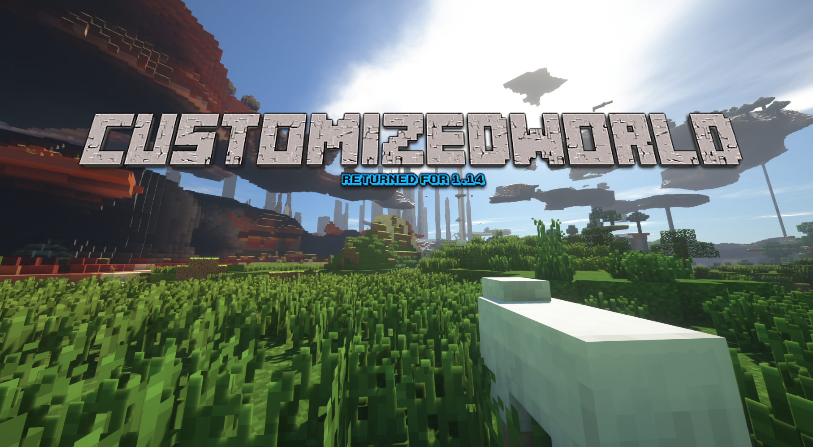

 

 
 
Customized World Generator
==========================
 
## Description
Minecraft のVersion 1.8 から 1.12 まであった「カスタマイズワールド」オプションを 1.14 でも使えるようにするための Server Plugin  
  
### World make/load 時に apply する customized option の order  
0. DEFAULT\_SETTINGS
1. spigot.jar の folder の customized.json (Server initialize に make)  
2. ${world\_name}/customized.json (World create に make)  
3. legacy\_custom\_options in WorldData  
  
## Usage
### Common
1. spigot.jar を install する。
2. spigot の Plugins フォルダに CustomizedWorldGenerator.jar をぶちこむ
  
### How to legacy world
3. 1.8 から 1.12 で使っていた World Data を spigot フォルダに入れる
4. 起動！
  
### New World!!
3. Multiverse-Core を入れる
4. 起動！
5. [mv create ${world\_name} normal -t CUSTOMIZED] で新しくワールドを作成

## Contribution
Donate の代わりに Amazon の wish リストでも貼っておくね！  
<https://www.amazon.co.jp/gp/registry/wishlist/1GT79HREJVH1C/ref=cm_wl_huc_view>  
  
## Licence
[GPLv3]  
<http://www.gnu.org/licenses/gpl-3.0.txt>  
  
## Author
Twitter : <https://twitter.com/bass_clef_>  
E-Mail  : bassclef.nico@gmail.com  
  
